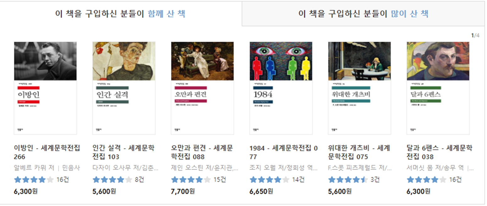
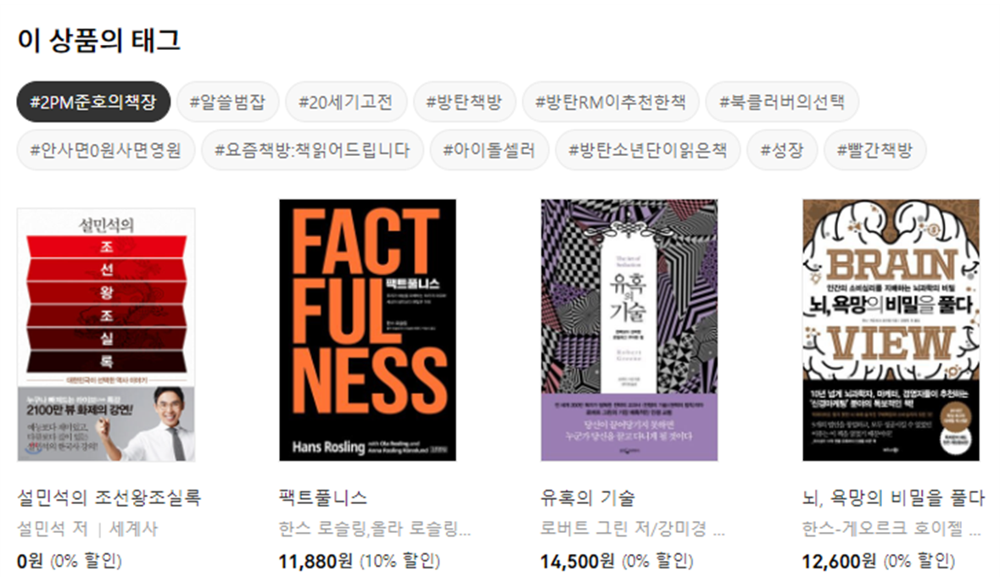
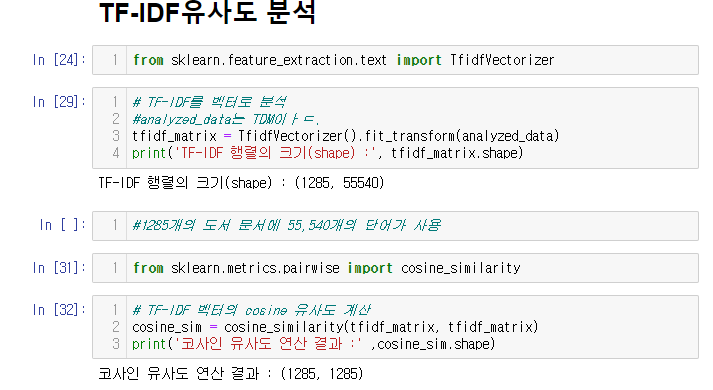
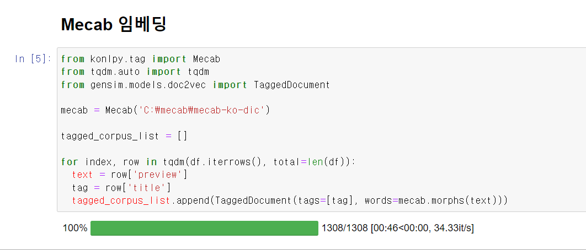
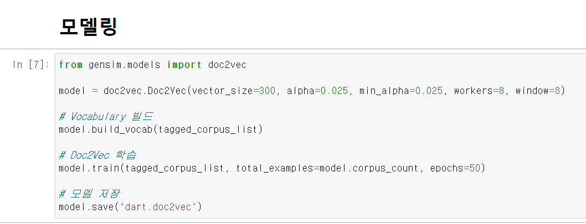
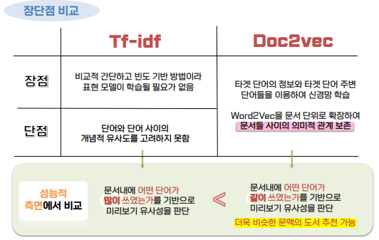
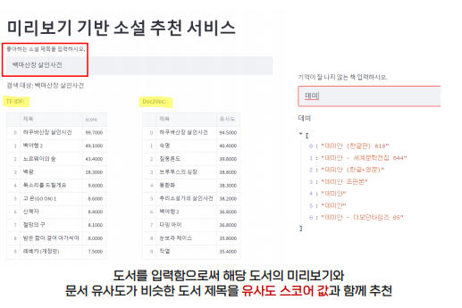

[toc]

 [세미프로젝트_부들부들조_최종.pptx](세미프로젝트_부들부들조_최종.pptx) ppt를 확인하세요!

# Preview based book recommendation system

## 1. 문제상황

많은 도서 포털 사이트에서는 불문명한 '태그'와 '도서추천'으로 원하는 도서를 찾기 어려움

1. 구매내역에 기반한 추천

2. 책의 내용에 기반한 태그 및 추천이 아닌, 수식어와 평가에 기반한 태그

## 2. 문제 해결

도서 포털의 미리보기를 통한 책 내용 유사도 검증으로 원하는 작품을 추천

## 3. 데이터 수집 및 전처리

### 1. 데이터 수집

1. YES24 ebook 소설 카테고리에서 스테디 셀러 42pages 미리보기 수집
2. YES24 ebook 소설 카테고리에서 한국소설, 영미소설 등 다양한 하부 카테고리에서 미리보기 수집
3. 총 7774개의 도서에 대한 데이터 확보

### 2. 데이터 전처리

1. 결측치 제거
2. 불용어 처리
3. 연속 공백 제거
4. 형태소 분석 : Mecab 형태

## 4. 모델 설계

### 1. TF-IDF 사용

단어의 빈도와 역 문서 빈도를 사용하여 DTM(문서단어행렬) 내에 각 단어들마다 중요한 정도를 가중치를 부여하는 Bag-of-Words 기반의 방식

### 2. Doc2vec 사용

Word2Vec의 확장으로 문장, 문단, 문서의 단위로 vector를 생성하는 방식

### 3. 두 모델의 장단점 비교

## 5. 서비스 구현

입력 : 도서 제목

출력 : 도서의 미리보기와 문서 유사도가 비슷한 도서 제목

기준 : 유사도 스코어값
