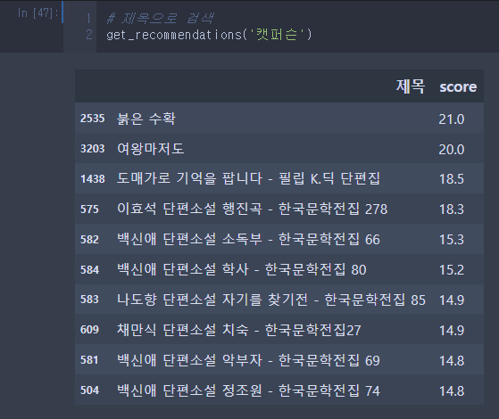
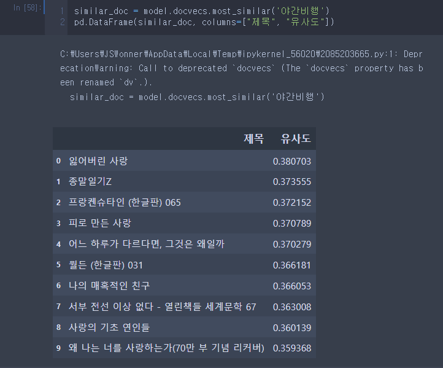
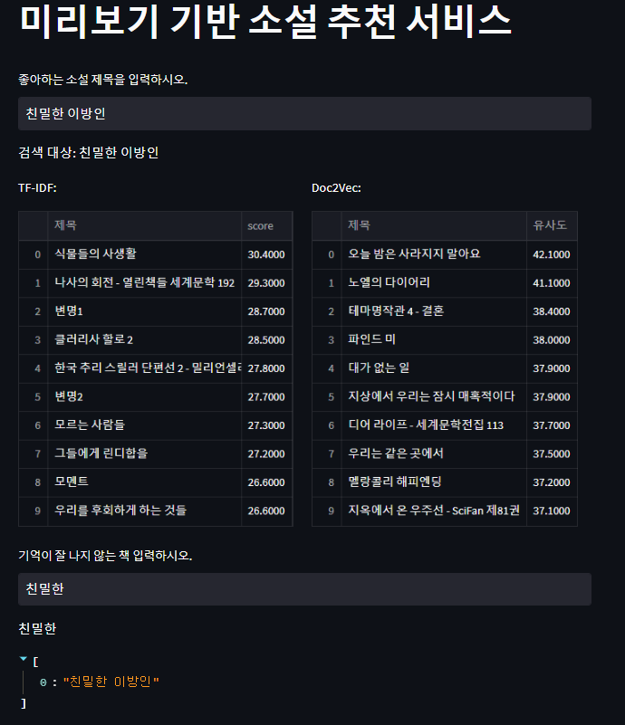

[toc]

멀티캠퍼스에서 진행된 도서 추천 시스템 프로젝트입니다. 팀원간 프로젝트를 확인하실려면 밑의 ppt를 확인해주세요.

 [세미프로젝트_부들부들조_최종.pptx](세미프로젝트_부들부들조_최종.pptx) ppt를 확인하세요!

아래의 설명은 97danielj(저장소 소유자)가 따로 진행한 프로젝트입니다.

'97danielj_progress'를 참조하세요.

# Preview based book recommendation system

## 1. 문제상황
요구 사항 : 독자는 자신이 감명 깊게 읽은 책과 유사한 '내용'의 책을 원하는 경향이 있음.

많은 도서 포털 사이트에서는 '태그(수식어)'와 '구매내역'기반한 추천 시스템은 광범위한 범위 때문에 사용자의 요구사항을 반영하지 못한다.

1. 구매내역에 기반한 추천

2. 책의 내용에 기반한 태그 및 추천이 아닌, 수식어와 평가에 기반한 태그

## 2. 문제 해결

도서 포털의 미리보기를 통한 책 내용 유사도 검증으로 원하는 작품을 추천

## 3. 데이터 수집 및 전처리

### 1. 데이터 수집

데이터는 json형식으로 저장하고, 도서제목과 미리보기 텍스트를 크롤링한다.

1. YES24 ebook 소설 카테고리에서 스테디 셀러 42pages 미리보기 수집
   - 838개
2. YES24 ebook 소설 카테고리에서 한국소설, 영미소설 등 다양한 하부 카테고리에서 미리보기 수집
   1. 한국소설 : 3307개
   2. 영미소설 : 3619개
   3. 추리소설 : 1966개
   4. sf소설 : 1580개
   5. 역사소설 : 430개
   6. 가족소설 : 114개
   7. 연애/사랑소설 : 1086개
   8. 어른을 위한 동화 : 379개
   9. 영화 드리마 원작 : 231개
   10. 희곡/시나리오 : 428개
3. 총 13,132개의 도서에 대한 데이터 확보

### 2. 데이터 전처리

많은 미리보기가 이미지로 되어있어서 도서 제목은 크롤링했지만, 미리보기는 결측치가 많았다.

1. 결측치 제거
2. 불용어 처리
3. 연속 공백 제거
4. 미리보기 1000자이하 도서 제거

데이터 전처리후 남은 도서 개수 :  4423개

형태소 분석기 Mecab을 사용하여 미리보기를 분석

## 4. 모델 설계

### 1. TF-IDF 사용

단어의 빈도와 역 문서 빈도를 사용하여 DTM(문서단어행렬) 내에 각 단어들마다 중요한 정도를 가중치를 부여하는 Bag-of-Words 기반의 방식

- TF-IDF 매트릭스를 생성했다면 코사인 유사도 행렬을 생성합니다. (4432, 4432) matrix
- 코사인 유사도 행렬은 자기 자신을 포함한 다른 도서 미리보기 간의 유사도가 기록된 행렬입니다.
- 영화를 입력하여 해당 제목에 해당하는 인덱스를 찾앗서 유사도 상위 10개의 도서를 출력합니다.

#### TF-IDF 출력

- 

### 2. Doc2vec 사용

Word2Vec의 확장으로 문장, 문단, 문서의 단위로 vector를 생성하는 방식

> Word2Vec : 단어 벡터 간 유의미한 유사도를 반영할 수 있도록 단어의 의미를 수치화하는 기법

- 기존의 단어의 원-핫 인코딩은 희소 표현이다. => 공간적 낭비와 단어간의 유사성을 표현할 수 없다.
- 밀집 벡터 
  - 인공신경망에서 가중치를 학습하는 것과 같은 방식으로 단어 벡터를 학습하는 방식
  - Doc2vec은 단어에서 문서 벡터를 밀집벡터로 표현하는 방식

####  doc2vec 출력

### 3. 두 모델의 장단점 비교

## 5. 서비스 구현

파이썬 패키지 streamlit으로 간편한 웹앱 구현

입력 : 도서 제목

출력

1. TF-IDF : 입력 제목의 미리보기의 TF-IDF 벡터와 코사인 유사도가 높은 상위 10개의 도서 출력
2. Doc2Vec : 입력 제목의 미리보기 문서 벡터와 코사인 유사도가 높은 상위 10개의 도서 출력

기준 : 유사도 스코어값

